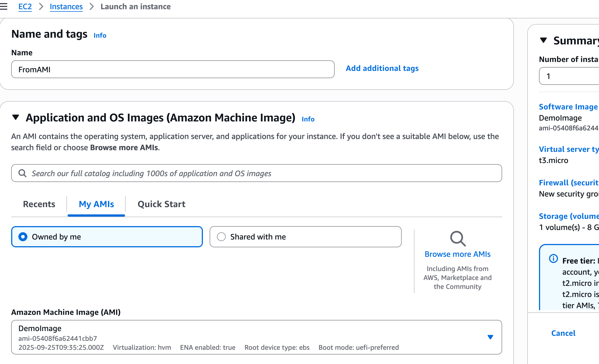
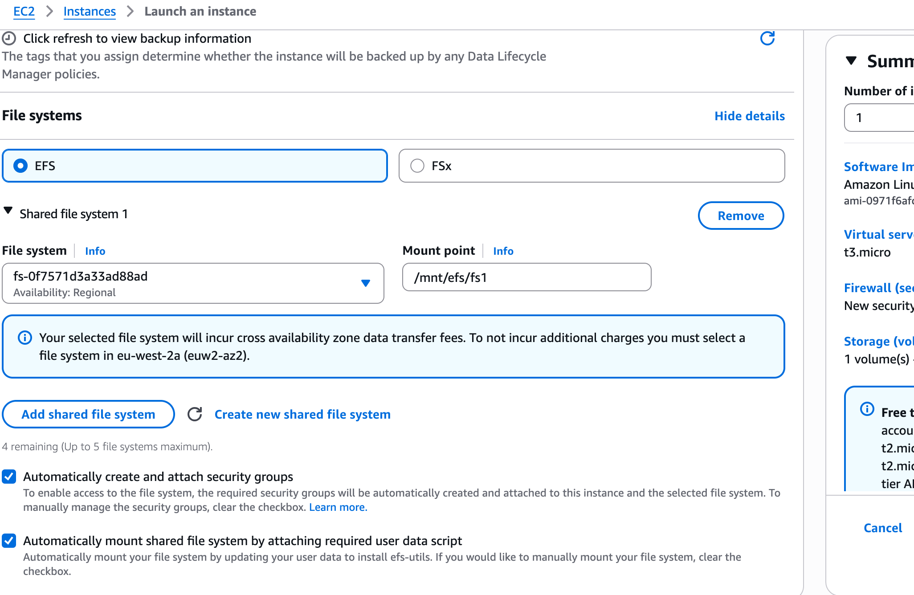
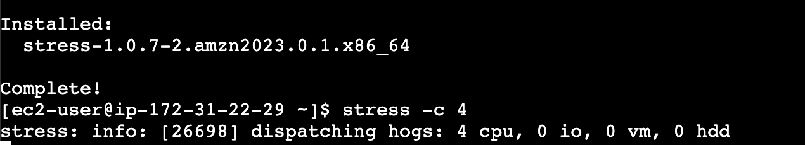
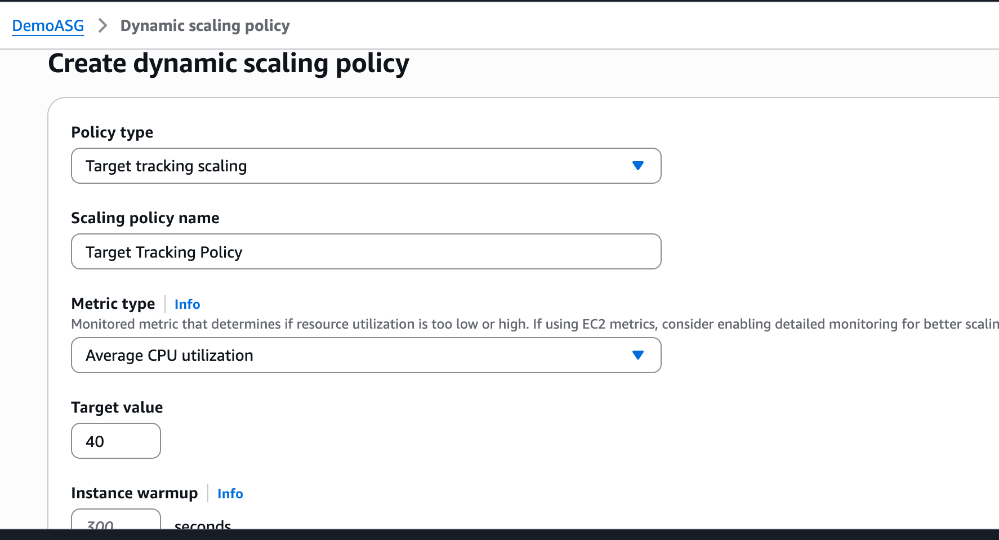
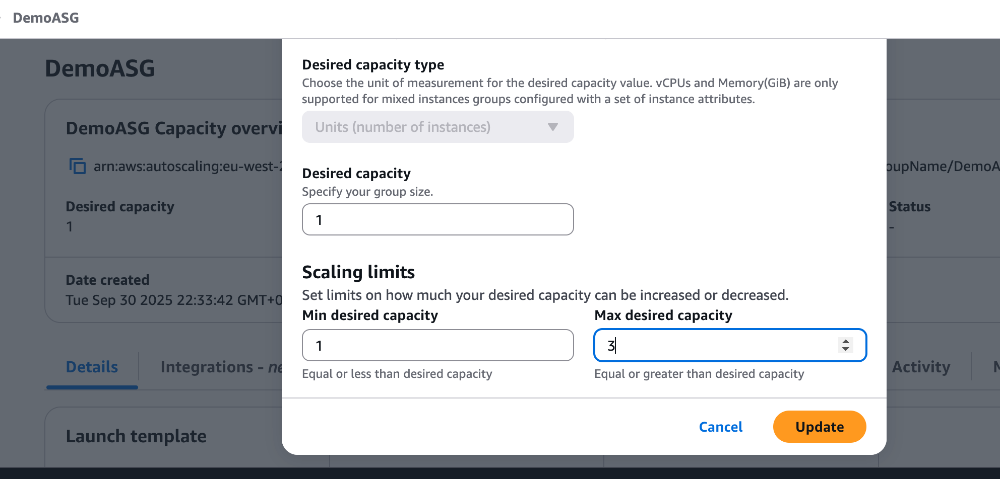
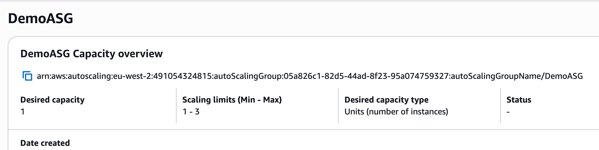

# AWS Solutions Architect Associate Labs

This repository documents my hands-on practice while preparing for the **AWS Solutions Architect Associate (SAA-C03)** certification using Stéphane Maarek’s course.

Each section contains:
- 📝 My own notes & explanations
- 📸 Screenshots of AWS Console/CLI
- 💻 Commands & configs (where relevant)

## Sections Completed (AWS SAA – Stephane Maarek)

- [x] Section 3 – IAM & AWS Fundamentals
- [x] Section 4 – EC2 Fundamentals
- [x] Section 5 – EC2 Deep Dive
- [x] Section 6 – EC2 Advanced: Placement Groups
- [x] Section 7 – EC2 Instance Storage
- [x] Section 8 – High Availability & Scalability: ELB & ASG
- [ ] Section 9 – RDS, Aurora & ElastiCache
- [ ] Section 10 – Route 53
- [ ] Section 11 – S3
- [ ] Section 12 – CloudFront
- [ ] Section 13 – Databases Overview (DynamoDB, etc.)
- [ ] Section 14 – VPC & Networking
- [ ] Section 15 – Monitoring & Audit (CloudWatch, CloudTrail, X-Ray)
- [ ] Section 16 – Identity Federation & Cognito
- [ ] Section 17 – AWS Security & Encryption
- [ ] Section 18 – Other Compute (Lambda, ECS, Fargate, Batch, etc.)
- [ ] Section 19 – Other Services (SQS, SNS, Kinesis, etc.)
- [ ] Section 20 – Architecting & Well-Architected Framework
- [ ] Section 21+ – Exam Preparation & Practice Exams

---

# AWS Free Tier & Cost Awareness

While working through these AWS SAA labs, I’ve ensured all resources stay within the Free Tier to avoid unnecessary costs.  

## Budget Setup
- AWS Budget: $0.01 monthly
- Notifications sent to my email/SNS to alert on any usage beyond Free Tier

## Free Tier Practices
- EC2: Only t2.micro or t3.micro instances
- S3: Max 5GB standard storage
- RDS: Free Tier databases (MySQL/PostgreSQL)
- Lambda: <= 1M requests/month
- CloudFront: <= 50GB/month
- Always terminate/delete resources immediately after use

## Screenshot of Budget Setup

# Section 4 – IAM (Identity & Access Management)

## What I learned
- IAM allows you to **control access** to AWS resources.
- Users, Groups, Roles, and Policies are the building blocks.
- AWS best practice: **Least privilege principle** — only give permissions needed.
- IAM roles can be assigned to EC2 instances or Lambda for temporary access.

## What I did
1. Created an IAM user for lab purposes.
2. Attached a policy (`AmazonS3ReadOnlyAccess`) to limit permissions.
3. Created an IAM group and added the user to it.
4. Created an IAM role and attached it to an EC2 instance.
5. Experimented with logging in as the IAM user and verifying permissions.

## Screenshots

# Section 5 – EC2 Fundamentals
📌 **What I learned:**  
- EC2 = Elastic Compute Cloud → virtual servers on demand.  
- Pricing models: On-Demand, Reserved, Spot, Dedicated.  
- Security groups act like virtual firewalls and how to add rules.
- SSH into instance from CLI on own computer.   

🛠 **What I did:**  
1. Launched a t2.micro EC2 instance in the AWS Free Tier.
2. Added .PEM key onto my mac. 
3. Connected via SSH from my own computer into an ec2 I created on AWS.  
4. Terminated the instance safely.
5. Added Security Groups and added/took away rules to show how it blocks certain protocols like HTTP.

📸 **Screenshots:**  
  

# Section 6 – EC2 (Solutions Architect Associate Level)

### What I Learned
- Placement Groups logically organize EC2 instances to meet specific performance or HA needs.
- **Cluster**: tightly packs instances in one AZ for low-latency, high-throughput networking.
- **Spread**: distributes instances across different racks → improves fault tolerance.
- **Partition**: separates groups of instances across partitions (good for Hadoop, Kafka).

### What I Did
1. Created a Placement Group in the AWS Console:
   - EC2 Dashboard → Placement Groups → Create.
   - Named it `test-cluster-group` and chose **Cluster** strategy.
2. Launched a new EC2 instance and assigned it to the Placement Group under **Advanced Details**.
3. Verified the instance was running in the group via the EC2 → Placement Groups view.

### Screenshots

# Section 7 – EC2 Instance Storage

## What I Learned
- **EBS (Elastic Block Store)**:
  - Network-attached storage for EC2.
  - Types:
    - GP2/GP3 → general purpose, balances cost and performance.
    - IO1/IO2 → provisioned IOPS, for databases.
    - ST1 → throughput optimized HDD, for big data.
    - SC1 → cold HDD, lowest cost.
  - Supports snapshots (backups) and encryption at rest.
- **Instance Store**:
  - Temporary storage physically attached to the host.
  - High performance but data is lost when the instance stops/terminates.
- **EFS (Elastic File System)**:
  - Fully managed NFS file system.
  - Shared across multiple EC2 instances, scales automatically.
- **AMI (Amazon Machine Images)**:
  - Templates that bundle an EC2’s configuration (OS, EBS volumes, software).
  - Can be created from a running instance → launch new instances consistently.

## What I Did
1. Created and attached an **EBS volume** to an EC2 instance, then mounted it inside Linux.
2. Took an **EBS snapshot** and restored it as a new volume.
3. Created a custom **AMI** from an instance and launched another instance from it.
4. Set up an **EFS file system** and mounted it across two EC2 instances for shared storage.

## Screenshots

# Section 8 – High Availability & Scalability (ELB & ASG)

## What I Learned
- **Elastic Load Balancers (ELB):**
  - Distribute traffic across multiple EC2 instances in different Availability Zones (AZs).
  - Provide health checks to ensure traffic only goes to healthy instances.
  - Types:
    - **Application Load Balancer (ALB):** Layer 7, supports path and host-based routing.
    - **Network Load Balancer (NLB):** Layer 4, ultra-low latency, millions of requests/sec.
    - **Gateway Load Balancer (GWLB):** Integrates with firewalls and network appliances.
- **Auto Scaling Groups (ASG):**
  - Automatically increase/decrease the number of EC2 instances based on demand.
  - Configured with **min, max, desired capacity** to balance performance and cost.
  - Integrates with **CloudWatch alarms** (e.g., CPU usage) for scaling triggers.
  - Ensures high availability by replacing failed instances automatically.
- **High Availability & Fault Tolerance:**
  - Deploy across multiple AZs to survive failures in one data center.
  - Combined ELB + ASG = resilient, scalable architecture.

## What I Did
1. Created an **Application Load Balancer (ALB)** and registered EC2 targets across two Availability Zones.  
2. Configured an **Auto Scaling Group (ASG)** with min=1, max=3, and scaling policies linked to CloudWatch alarms.  
3. Simulated high CPU load → ASG launched new instances automatically.  
4. Terminated one EC2 instance manually → ELB rerouted traffic and ASG replaced the instance.  

## Screenshots
  
  
  
  

# Section 9 – AWS Fundamentals: RDS, Aurora, and ElastiCache

## What I Learned
- **RDS (Relational Database Service)**:
  - Managed relational database service (MySQL, PostgreSQL, MariaDB, Oracle, SQL Server, Aurora).
  - Provides automated backups, Multi-AZ failover, read replicas, and scaling.
  - Handles patching, upgrades, and monitoring so you don’t have to manage servers directly.
- **Aurora**:
  - AWS proprietary, MySQL- and PostgreSQL-compatible relational database.
  - Up to 5x faster than MySQL and 3x faster than PostgreSQL.
  - Auto-scaling storage (up to 128 TB), high availability with replication across 3 AZs.
  - Ideal for enterprise workloads needing high performance + managed infrastructure.
- **ElastiCache**:
  - Managed in-memory caching (Redis, Memcached).
  - Use cases: reduce read load on RDS/DynamoDB, session stores, real-time leaderboards.
  - Improves performance by offloading frequent queries from databases.

## What I Did
1. Created an **RDS instance** (MySQL) in a Multi-AZ deployment for high availability.
2. Configured a **Read Replica** for scaling read-heavy workloads.
3. Created an **Aurora cluster** to test high performance and automatic replication.
4. Deployed an **ElastiCache Redis cluster**, connected it to an EC2 app to cache queries.
5. Demonstrated failover by simulating instance downtime → observed automatic failover.

## Screenshots

