# AWS Solutions Architect Associate Labs

This repository documents my hands-on practice while preparing for the **AWS Solutions Architect Associate (SAA-C03)** certification using Stéphane Maarek’s course.

Each section contains:
- 📝 My own notes & explanations
- 📸 Screenshots of AWS Console/CLI
- 💻 Commands & configs (where relevant)

## Sections Completed
- [x] IAM & AWS Fundamentals
- [ ] EC2 Deep Dive (in progress)
- [ ] Elastic Load Balancing & Auto Scaling
- [ ] S3 & CloudFront
- [ ] RDS, DynamoDB, Aurora
- [ ] VPC & Networking
- [ ] Security & Monitoring
- [ ] Architecture & Exam Prep

---

# AWS Free Tier & Cost Awareness

While working through these AWS SAA labs, I’ve ensured all resources stay within the Free Tier to avoid unnecessary costs.  

## Budget Setup
- AWS Budget: $0.01 monthly
- Notifications sent to my email/SNS to alert on any usage beyond Free Tier

## Free Tier Practices
- EC2: Only t2.micro or t3.micro instances
- S3: Max 5GB standard storage
- RDS: Free Tier databases (MySQL/PostgreSQL)
- Lambda: <= 1M requests/month
- CloudFront: <= 50GB/month
- Always terminate/delete resources immediately after use

## Screenshot of Budget Setup
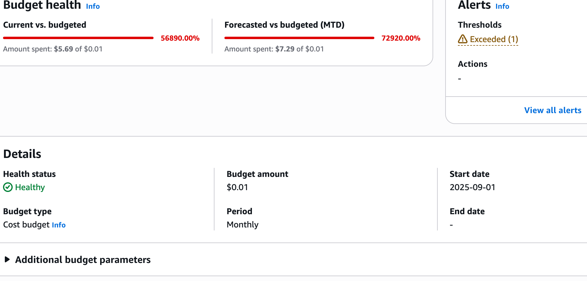

# Section 4 – IAM (Identity & Access Management)

## What I learned
- IAM allows you to **control access** to AWS resources.
- Users, Groups, Roles, and Policies are the building blocks.
- AWS best practice: **Least privilege principle** — only give permissions needed.
- IAM roles can be assigned to EC2 instances or Lambda for temporary access.

## What I did
1. Created an IAM user for lab purposes.
2. Attached a policy (`AmazonS3ReadOnlyAccess`) to limit permissions.
3. Created an IAM group and added the user to it.
4. Created an IAM role and attached it to an EC2 instance.
5. Experimented with logging in as the IAM user and verifying permissions.

## Screenshots
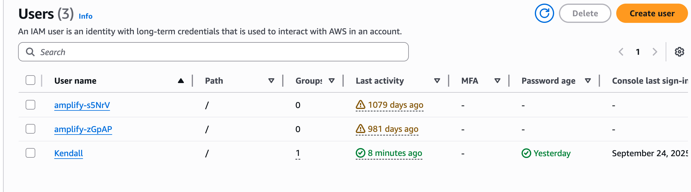
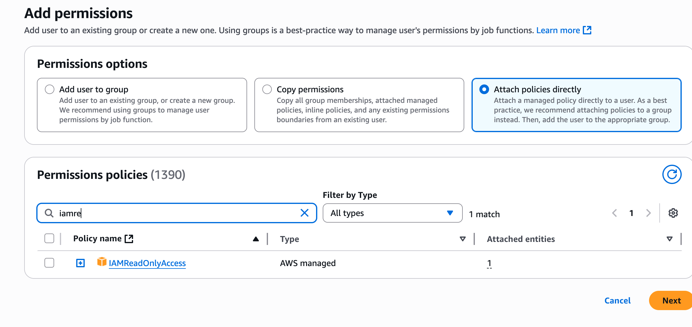

# Section 5 – EC2 Fundamentals
📌 **What I learned:**  
- EC2 = Elastic Compute Cloud → virtual servers on demand.  
- Pricing models: On-Demand, Reserved, Spot, Dedicated.  
- Security groups act like virtual firewalls and how to add rules.
- SSH into instance from CLI on own computer.   

🛠 **What I did:**  
1. Launched a t2.micro EC2 instance in the AWS Free Tier.
2. Added .PEM key onto my mac. 
3. Connected via SSH from my own computer into an ec2 I created on AWS.  
4. Terminated the instance safely.
5. Added Security Groups and added/took away rules to show how it blocks certain protocols like HTTP.

📸 **Screenshots:**  
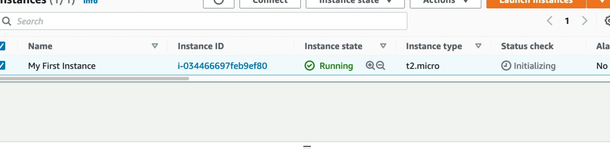  
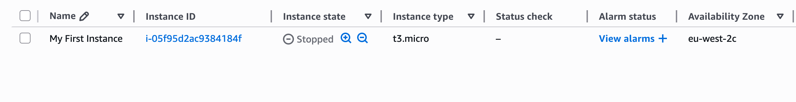
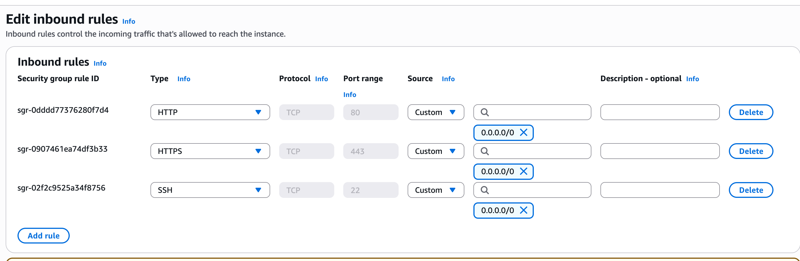
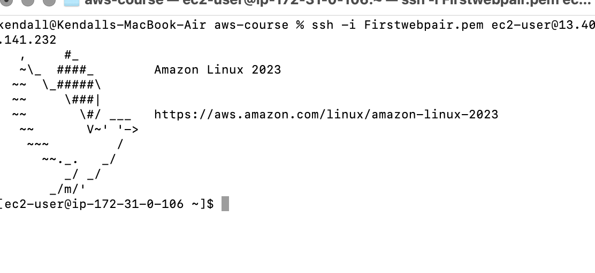

# Section 6 – EC2 (Solutions Architect Associate Level)

### What I Learned
- Placement Groups logically organize EC2 instances to meet specific performance or HA needs.
- **Cluster**: tightly packs instances in one AZ for low-latency, high-throughput networking.
- **Spread**: distributes instances across different racks → improves fault tolerance.
- **Partition**: separates groups of instances across partitions (good for Hadoop, Kafka).

### What I Did
1. Created a Placement Group in the AWS Console:
   - EC2 Dashboard → Placement Groups → Create.
   - Named it `test-cluster-group` and chose **Cluster** strategy.
2. Launched a new EC2 instance and assigned it to the Placement Group under **Advanced Details**.
3. Verified the instance was running in the group via the EC2 → Placement Groups view.

### Screenshots
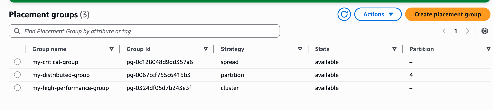
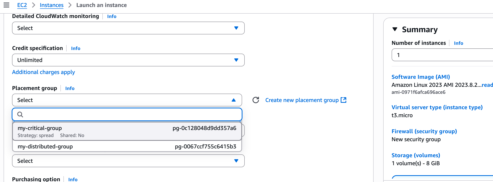

# Section 7 – EC2 Instance Storage

## What I Learned
- **EBS (Elastic Block Store)**:
  - Network-attached storage for EC2.
  - Types:
    - GP2/GP3 → general purpose, balances cost and performance.
    - IO1/IO2 → provisioned IOPS, for databases.
    - ST1 → throughput optimized HDD, for big data.
    - SC1 → cold HDD, lowest cost.
  - Supports snapshots (backups) and encryption at rest.
- **Instance Store**:
  - Temporary storage physically attached to the host.
  - High performance but data is lost when the instance stops/terminates.
- **EFS (Elastic File System)**:
  - Fully managed NFS file system.
  - Shared across multiple EC2 instances, scales automatically.
- **AMI (Amazon Machine Images)**:
  - Templates that bundle an EC2’s configuration (OS, EBS volumes, software).
  - Can be created from a running instance → launch new instances consistently.

## What I Did
1. Created and attached an **EBS volume** to an EC2 instance, then mounted it inside Linux.
2. Took an **EBS snapshot** and restored it as a new volume.
3. Created a custom **AMI** from an instance and launched another instance from it.
4. Set up an **EFS file system** and mounted it across two EC2 instances for shared storage.

## Screenshots
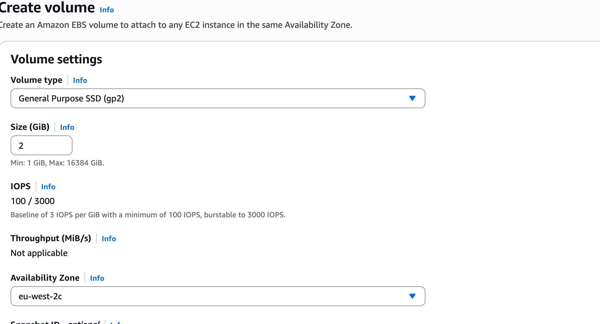
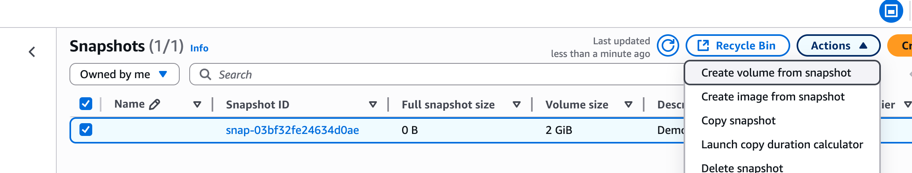

